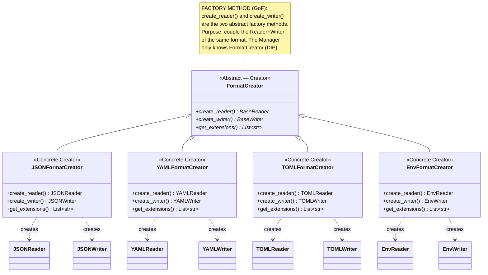
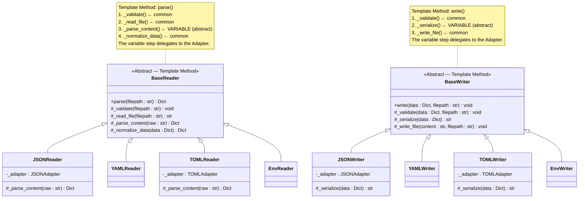
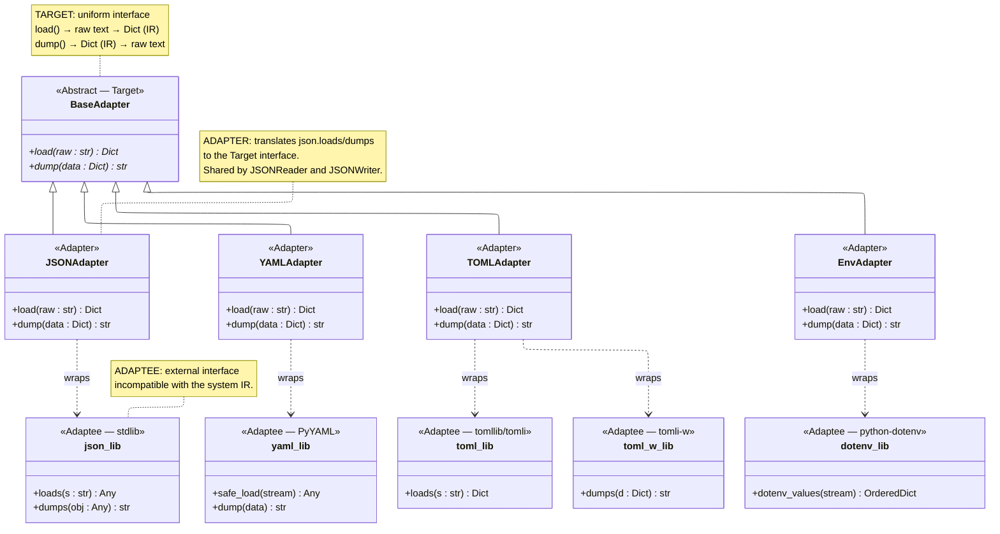
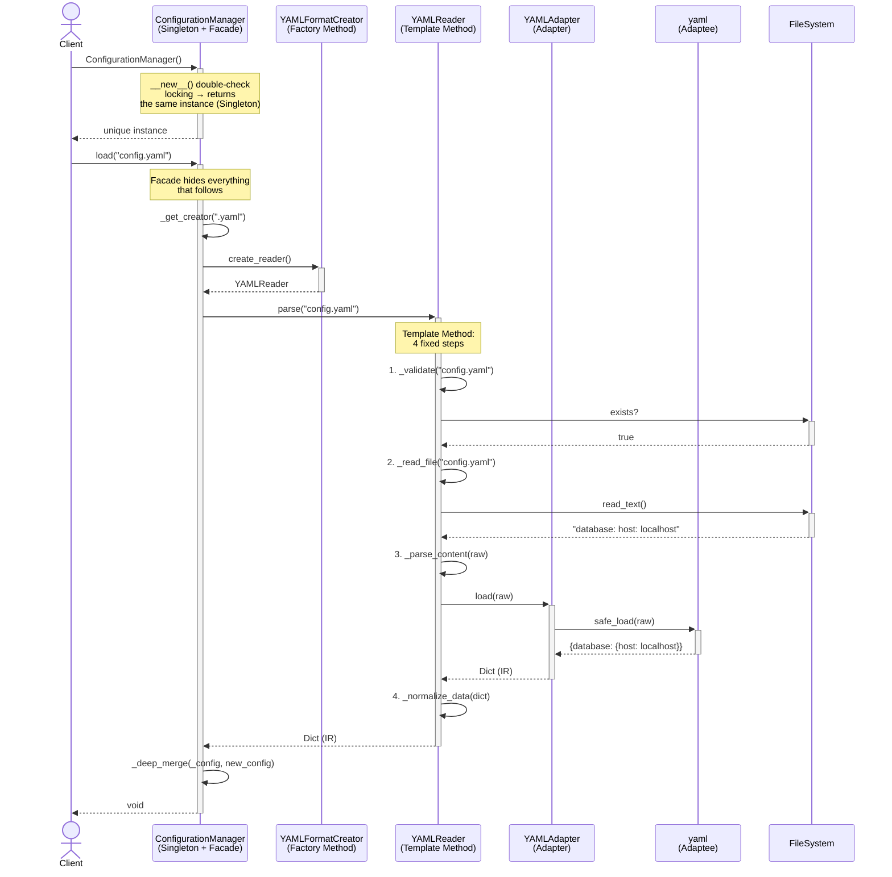
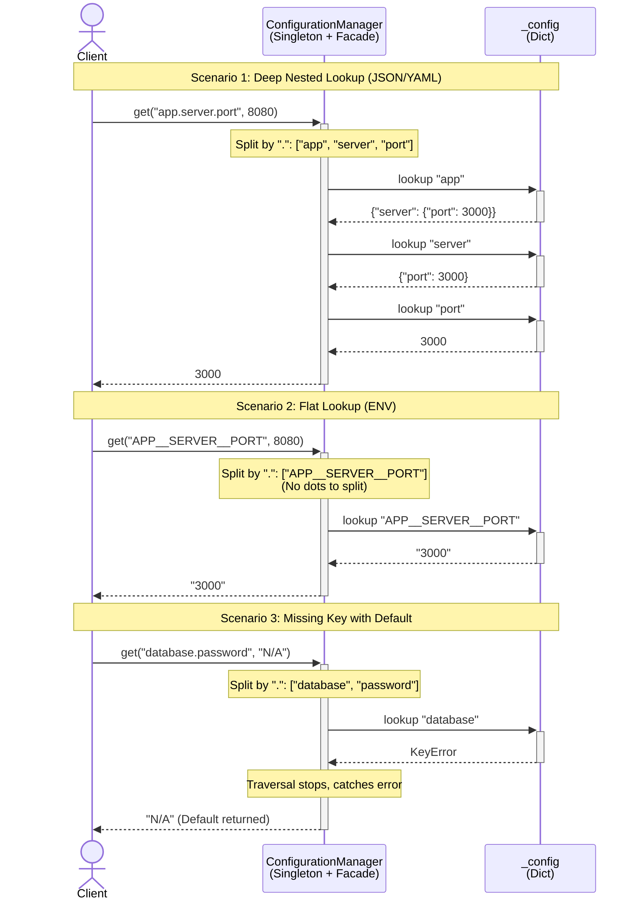
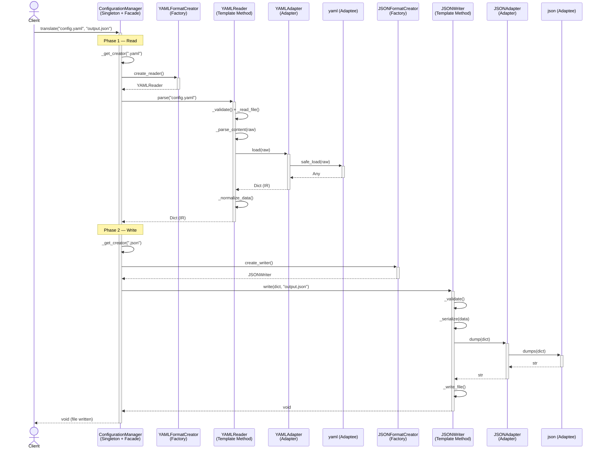

# Architecture

> Proteus is built around five GoF design patterns arranged in a deliberate stack. Each layer has a single responsibility and delegates down to the next.

## Pattern Stack

```
┌─────────────────────────────────────────────┐
│  Optional Singleton + Facade (ConfigurationManager) │  ← single entry point
├─────────────────────────────────────────────┤
│  Factory Method      (FormatCreator)        │  ← selects reader/writer
├─────────────────────────────────────────────┤
│  Template Method     (BaseReader/BaseWriter)│  ← defines the algorithm
├─────────────────────────────────────────────┤
│  Adapter             (BaseAdapter)          │  ← wraps third-party libs
└─────────────────────────────────────────────┘
```

| Pattern | Class | Responsibility |
|---|---|---|
| **Singleton** | `ConfigurationManager.instance()` | One global instance, thread-safe |
| **Facade** | `ConfigurationManager` | Simple API over the full pattern stack |
| **Factory Method** | `FormatCreator` and subclasses | Create the right Reader/Writer pair |
| **Template Method** | `BaseReader`, `BaseWriter` | Fixed algorithm, format-specific steps |
| **Adapter** | `BaseAdapter` and subclasses | Wrap `json`, `pyyaml`, `tomllib`, `dotenv` |

---

## Component Map

```mermaid
flowchart TD
    Client --> CM[ConfigurationManager Facade]
    Client --> S[ConfigurationManager.instance() Optional Singleton]

    CM --> FC{FormatCreator Factory Method}
    S --> FC

    FC --> JC[JSONFormatCreator]
    FC --> YC[YAMLFormatCreator]
    FC --> TC[TOMLFormatCreator]
    FC --> EC[EnvFormatCreator]

    JC --> JR[JSONReader] & JW[JSONWriter]
    YC --> YR[YAMLReader] & YW[YAMLWriter]
    TC --> TR[TOMLReader] & TW[TOMLWriter]
    EC --> ER[EnvReader] & EW[EnvWriter]

    JR & JW --> JA[JSONAdapter wraps: json]
    YR & YW --> YA[YAMLAdapter wraps: pyyaml]
    TR & TW --> TA[TOMLAdapter wraps: tomllib/tomli-w]
    ER & EW --> EA[EnvAdapter wraps: python-dotenv]
```

### Factory Method: FormatCreator
`ConfigurationManager` uses the Factory Method pattern to select the appropriate `FormatCreator` based on file extension. Each `FormatCreator` knows how to create its own Reader and Writer, which in turn use Adapters to interact with third-party libraries.



### Template Method: BaseReader/BaseWriter
`BaseReader` and `BaseWriter` define the skeleton of the parsing and writing algorithms. The concrete Readers/Writers implement the format-specific steps, while the Base classes handle common logic like file I/O and error handling.



### Adapter: BaseAdapter
The Adapters wrap the third-party libraries and expose a consistent interface to the Readers/Writers. This isolates external dependencies and allows for easier maintenance or swapping of libraries in the future.




---

## Intermediate Representation (IR)

All formats share a single common structure in memory: a plain Python `Dict[str, Any]`. This is what enables format-agnostic merging and translation.

```
.json file  ──┐
.yaml file  ──┤
.toml file  ──┤─── Reader.parse() ──► Dict[str, Any]  ──► Writer.write() ──► file
.env file   ──┘          (IR)
```

### Nested formats (JSON, YAML)

Both JSON and YAML map naturally to nested Python dicts:

```json
// config.json
{
  "database": {
    "host": "localhost",
    "port": 5432
  },
  "app": {
    "debug": true
  }
}
```

```python
# IR in memory — identical regardless of whether source was JSON or YAML
{
    "database": {"host": "localhost", "port": 5432},
    "app": {"debug": True},
}
```

### Flat format (ENV)

The `.env` format has no native nesting. To maintain a unified experience, Proteus uses the `__` separator convention:
- **On Write**: Nested dictionaries are flattened (e.g. `{"DB": {"HOST": "..."}}` → `DB__HOST=...`).
- **On Read**: Flat keys are automatically **unflattened** back into dictionaries.

This ensures that `config.get("DB.HOST")` works regardless of the source format.

### Accessing the IR

`ConfigurationManager.get()` navigates the IR using **dot-notation**:

```python
config.get("database.host")   # → "localhost"  (nested key)
config.get("DATABASE__HOST")  # → "localhost"  (flat ENV key)
config.get("missing", "N/A") # → "N/A"        (default)
```

---

## Data Flow: `load()` / `merge()`



---

## Data Flow: `get()`

`get(key, default)` retrieves values from the internal configuration dictionary (IR). It supports dot-notation for navigating nested structures, handling missing keys safely by returning the provided default.



---

## Data Flow: `translate()`

`translate(src, dst)` selects **two independent creators**: one for the source file extension, one for the destination. Each creator produces its own Reader or Writer. There is no shared state between them.

```
translate("config.yaml", "config.json")
        └──────────────┘ └─────────────┘
        ↓ extension: .yaml          ↓ extension: .json
    YAMLFormatCreator            JSONFormatCreator
    ↓ create_reader()            ↓ create_writer()
    YAMLReader                   JSONWriter
```




`translate()` does **not** touch `self._config` — it is a pure file-to-file conversion.

---

## Deep-Merge Semantics

When loading multiple files, nested dicts are merged recursively. Scalar values from the later file always win:

```python
# base.yaml          # prod.yaml          # result
database:            database:            database:
  host: localhost       host: prod-db        host: prod-db   ← overridden
  port: 5432                                 port: 5432      ← preserved
```

---

## Extensibility

New formats can be added at runtime without modifying existing code (Open/Closed Principle):

```python
mgr = ConfigurationManager()
mgr.register_creator(TOMLFormatCreator())  # plugged in dynamically
mgr.load("config.toml")                   # works immediately
```

A custom creator only needs to implement three methods: `create_reader()`, `create_writer()`, and `get_extensions()`. Everything else — Template Method, Adapter wiring — is inherited from the base classes.
