# ConfigurationManager

> **GoF Patterns: Singleton + Facade** — Single global instance that hides the entire pattern stack behind a simple API.

## Overview

`ConfigurationManager` is the central entry point of Proteus. It maintains
a single configuration state (the IR — `Dict[str, Any]`) and exposes
high-level operations that internally orchestrate Factory Method, Template
Method, and Adapter.

Defined in `src/proteus/core.py`.

## Singleton Behavior

`__new__` uses double-check locking with `threading.Lock` to guarantee a
unique instance even under concurrent access.

```python
from proteus import ConfigurationManager

a = ConfigurationManager()
b = ConfigurationManager()
assert a is b  # always the same instance
```



```mermaid
sequenceDiagram
    participant C as Client
    participant CM as ConfigurationManager
    participant L as Lock
    participant I as Instance

    C->>CM: ConfigurationManager()

    rect rgb(8, 28, 45)
    Note over CM,I: __new__ — Creation
    CM->>CM: Check _instance == None
    opt First check passes
        CM->>L: acquire()
        CM->>CM: Re-check _instance == None
        opt Second check passes
            CM->>I: super().__new__(cls)
            CM->>CM: cls._instance = instance
            CM->>I: _initialized = False
        end
        L-->>CM: release()
    end
    CM-->>C: return _instance
    end

    rect rgb(16, 56, 16)
    Note over C,I: __init__ — Initialization
    C->>I: __init__()
    I->>I: Check _initialized
    alt False — first time
        I->>I: _config = {}
        I->>I: register default creators
        I->>I: _initialized = True
    else True — skip
        I-->>C: return
    end
    end
```

## Public API

### `load(filepath: str) → None`

Load a configuration file and **deep-merge** it into the current IR.
Values from the new file win on conflict.

| Raises | When |
|--------|------|
| `UnsupportedFormatError` | Unknown file extension. |
| `FileNotFoundError` | File does not exist. |
| `ValueError` | Content cannot be parsed. |

### `merge(filepath: str) → None`

Alias for `load()` — semantically clearer when merging multiple sources.


### `get(key: str, default=None) → Any`

Access a value via **dot-notation**.

```python
config.get("database.host")       # nested access
config.get("missing.key", "N/A")  # returns default
```

Raises `ConfigurationNotLoadedError` if no file has been loaded yet.


### `get_all() → Dict[str, Any]`

Returns a shallow copy of the entire IR.

### `translate(input_path: str, output_path: str) → None`

Convert a file from one format to another. This is where all five
patterns collaborate:

1. **Facade** — `translate()` hides the orchestration.
2. **Factory Method** — selects the correct creators by extension.
3. **Template Method** — `reader.parse()` / `writer.write()`.
4. **Adapter** — `load()` / `dump()` inside readers/writers.
5. **Singleton** — the client calls this on the unique instance.


### `register_creator(creator: FormatCreator) → None`

Register a custom `FormatCreator` at runtime for third-party formats.
See [formats.md](formats.md#adding-a-new-format).

### `reset() → None`

Clear internal state (config data + loaded-file list). Does **not**
destroy the singleton instance.

### `loaded_files() → List[str]`

Returns a copy of the list of loaded file paths (resolved to absolute).

## Deep-Merge Semantics

When loading multiple files, nested dicts are merged recursively.
Scalar values from the later file always win:

```python
# base.yaml: {database: {host: localhost, port: 5432}}
# prod.yaml: {database: {host: prod-db}}

config.load("base.yaml")
config.merge("prod.yaml")
config.get_all()
# → {'database': {'host': 'prod-db', 'port': 5432}}
```

## Exceptions

| Exception | Description |
|-----------|-------------|
| `ConfigurationError` | Base class for all Proteus exceptions. |
| `UnsupportedFormatError` | No creator registered for the file extension. |
| `InvalidKeyError` | Reserved for future use. |
| `ConfigurationNotLoadedError` | `get()` called before any `load()`. |

All exceptions are importable from the `proteus` package.
